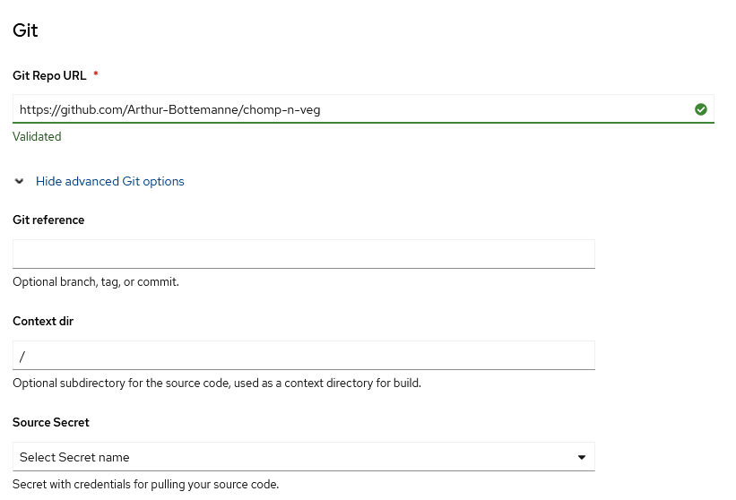
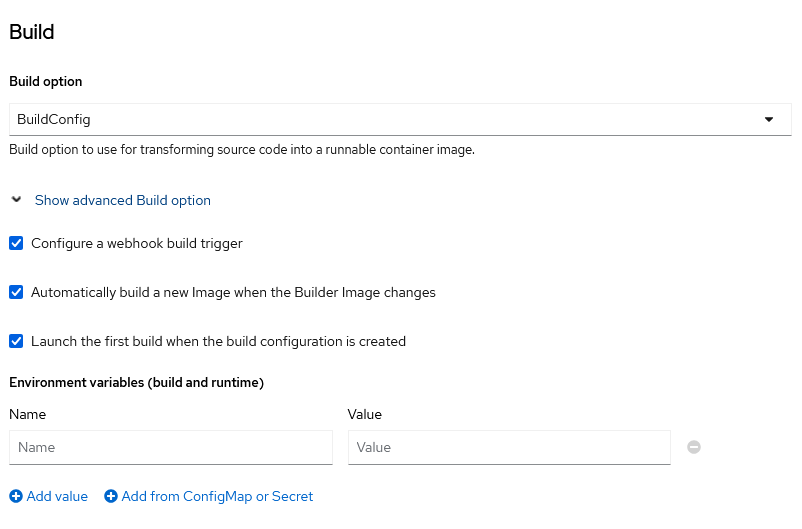
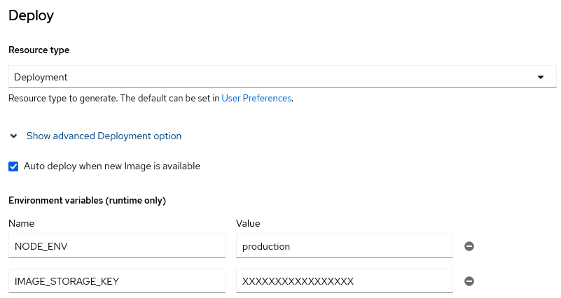
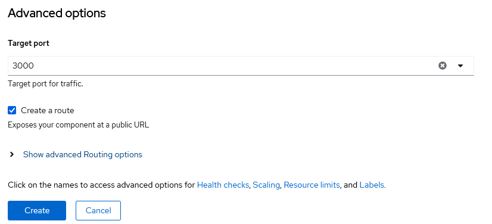
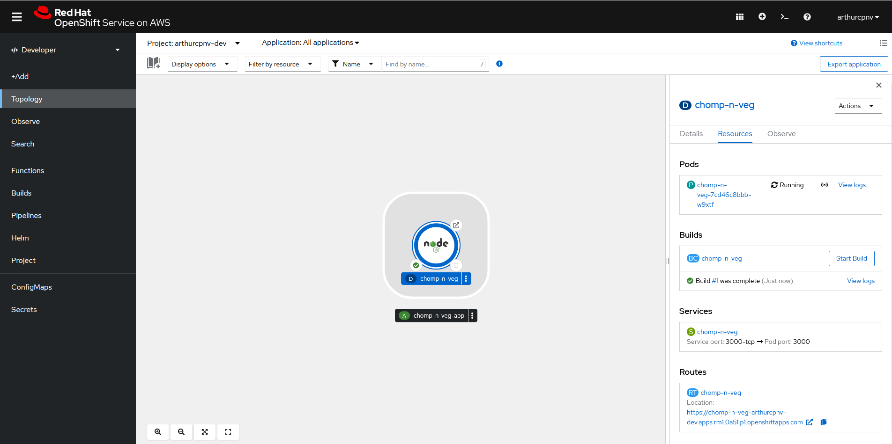
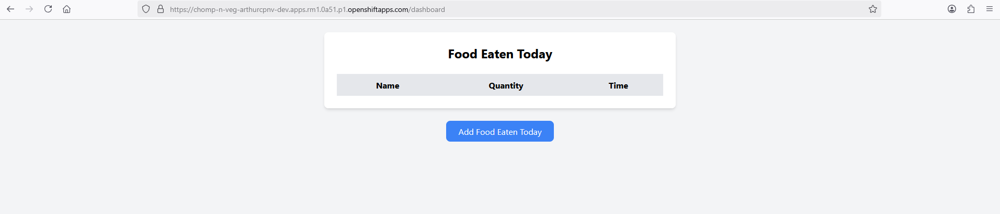
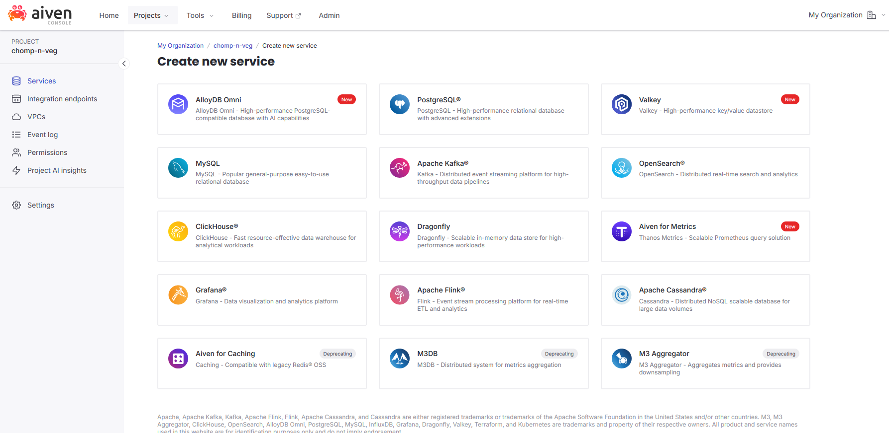
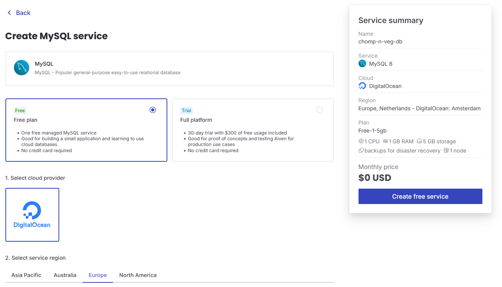
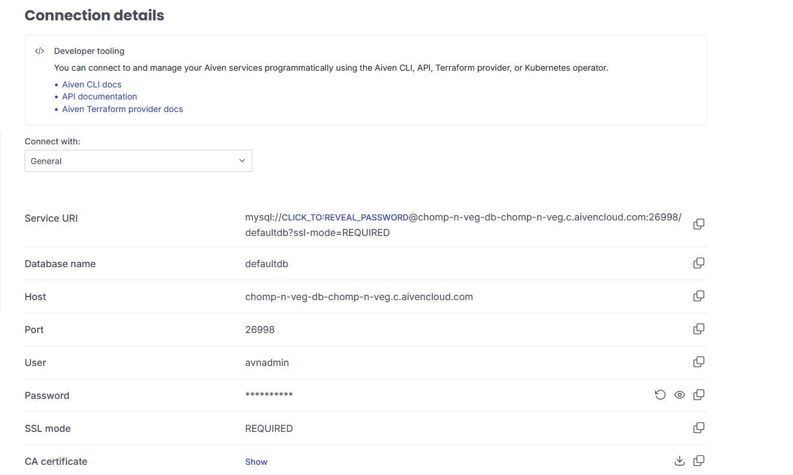
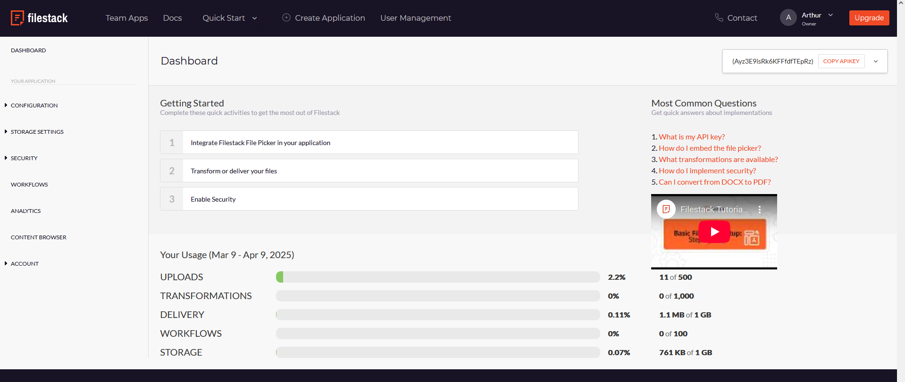

# Mise en place des plateformes cloud

## Déploiement web

Pour le déploiement web, j'utilise OpenShift pour héberger l'application.

1. Importer le projet

Pour ce faire, il faut importer le projet depuis git. Dans l'onglet "+Add", on peut voir l'option "import from git".

2. Git

Mettez l'url du répertoire.

3. Build

Vérifiez que l'option build "BuildConfig" est sélectionnée.

4. Deploy

Changez ressource type à "Deployment" et rajouter les variables d'environnement.

5. Advanced options

Changez le "target port" par le port ou est servit votre application.

On peut ensuite cliquer sur "Create".

Un build de l'image du projet s'exécutera puis un pod sera automatiquement créer.

On peut confirmer que l'application soit bien déployer en allant sur l'url du pod.

## La base de données

Pour la base de données, j'utilise aiven pour créer et manager la base de données.

1. Create new service

Après avoir créé un compte, créer un nouveau service MySQL

2. Configuration

Choisissez le "free plan", la région souhaitez et le nom.

3. Connection details

Copiez ensuite les logins de la db et rajouter les variables d'environnement au déploiement web.

## Le stockage des images

Pour le stockage des images, j'utilise filestack.

1. Copier la clé API

Après avoir créer votre compte, vous pouvez vous connecter à votre dashboard et copier directement la clé API

