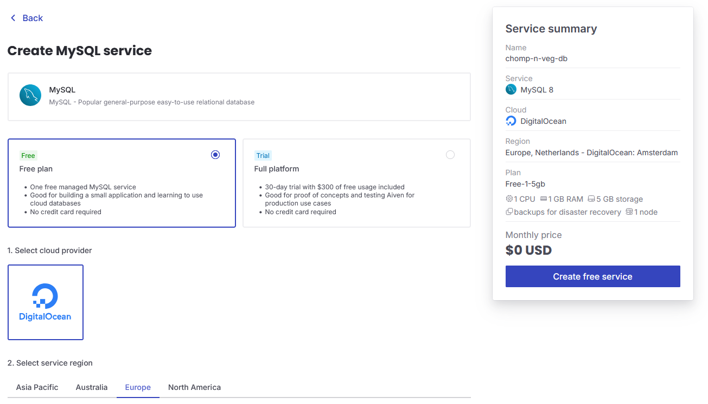
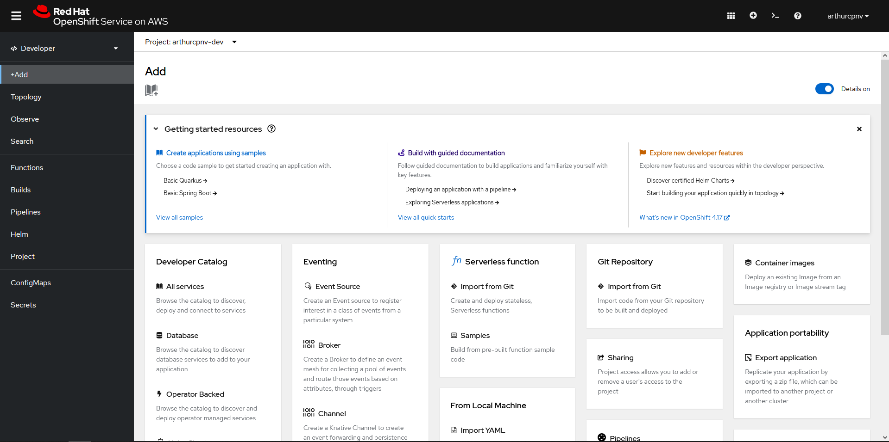
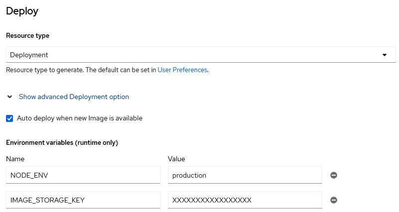
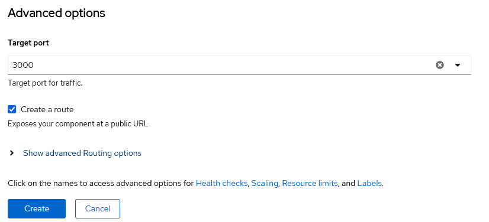

# Le Cloud Computing

---

# Les Principes du Cloud Computing

- **Fédération**

- **Indépendance**  

- **Isolation**  

- **Élasticité**  

- **Personnalisation**

- **Confiance**

---

# IaaS – Infrastructure as a Service

---

# PaaS – Platform as a Service

---

# SaaS – Software as a Service

---

# Avantages du Cloud

- **Scalabilité et Flexibilité**

- **Réduction des coûts**

- **Sécurité avancée**

---

# Désavantages du Cloud

- **Dépendance au Fournisseur**  

- **Personnalisation Limitée**  

- **Sécurité et Conformité**  

---

# Exemples Concrets par Modèle

- **IaaS :**
  - Aiven
  - AWS EC2

- **PaaS :**  
  - Red Hat OpenShift
  - Google App Engine

- **SaaS :**  
  - FileStack
  - Microsoft Office 365

---

# Démonstration technique

## La base de données

---

1. Create new service

---

2. Configuration

---

3. Connection details

--- 

# Démonstration technique

## Le stockage des images

---

1. Copier la clé API

---

# Démonstration technique

## Déploiement web

---

1. Importer le projet

---

2. Git

---

3. Build

---

4. Deploy

---

5. Advanced options

---

# Fin
